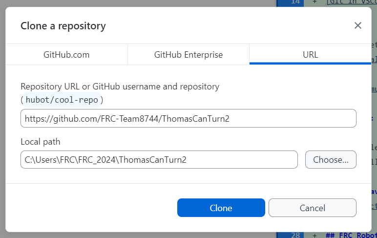

**Mistakes were made!**: Learn about Github from this lesson, but don't worry about control loop tuning or test mode.  There was a big error in this code that will be corrected next lesson.

# Lesson 4: Thomas can turn! (yet again!)  11/02/2023
Let's do a quick review of what we've learned so far:
* Basic arcade-style driving of the robot
* Feedforward and PID concepts
* Applying basic P control to turn the robot

The turning control we learned so far was actually just a routine to keep the robot driving in a straight line.  We're going to build on that idea, and explore different ways to debug problems in the robot code.  Also, to save time we are going to try downloading an example I have already adapted to Thomas.  That way we can just compare the changes and not do so much cut/paste.

## Everyone must have a GitHub account at this point!
If not, tell me and we will get it done.  I will need to invite your account to the team repository.

What is Git?  What is GitHub?

## Overview of GitHub in VSCode
We will use GitHub Desktop for most upload/downloads, but some file comparisons are easier in VSCode: [Overview video](https://www.youtube.com/watch?v=i_23KUAEtUM) <!-- 7 min -->

If you want to learn more:
* [Git in VSCode Documentation](https://code.visualstudio.com/docs/sourcecontrol/overview)

## Programming: Download code and review changes
1. Open GitHub Desktop and log in with your account.
2. Click on `File` -> `Clone repository...`
3. Select the `URL` tab and enter the following:

```
https://github.com/FRC-Team8744/ThomasCanTurn2
```
4. Now switch to VSCode.
5. If you see code, click `File` -> `Close Folder`
6. Open the new project: `File` -> `Open Folder...`
> What you are seeing is the WPILib example program `Gyro Drive Commands` that has been updated to run on Thomas.  (This was the challenge code from last week)
7. Click on the Explorer tab on the left if you don't have the file list.
8. Open up `DriveSubsystem.java`
9. Look down at the bottom of the Explorer sidebar, and click on `TIMELINE`
10. Click on the commit labeled `Update to Thomas`.
> Review the following:
> * [`DriveSubsystem.java`] How did the SparkMax definition change?
> * [`RobotContainer.java`] Look at the differences between joystick types.
> * [`Constants.java`] How do you calculate the distance the robot moves?
11. Take turns downloading the program to Thomas. Verify it works.

## Control loop tuning
1. The X button tells the robot to turn 90 degrees when you press it. We are going to practice tuning the controller (i.e. the command "TurnToAngle.java")
2. We are going to use "Test" mode to tune the loop, because it should be faster than re-deploying the program with different constants.  **Be Cautious!**  I don't think the values are error-checked, so you can cause real harm with a bad value.
> Note! The robot expects to be pointing to 0 degrees when the button is pressed.  You will have to manually turn it back for the next test.
3. Test mode is intended for quickly checking out motors and sensors to see if they are working, but it expects the programmer to be very carefull about what they are doing.  Because of this, it disable the normal scheduler that is used to run commands.  But we need this!  So we have to add the following to `Robot.java` in `testPeriodic`:
```java
CommandScheduler.getInstance().enable();
```
4. Now you should be able to move the robot in test mode.  Reset the robot orientation to zero degrees, change the P value in LiveWindow and press the X button.  **BE READY TO DISABLE THE ROBOT!**

## Profiled motion
There is another command in the code called `TurnToAngleProfiled`.  Profiled motion allows us to limit the maximum speed and acceleration of the turn.  It is easy to think that the robot is already limited because it cannot accelerate immediately from a standing start, but what about stopping?  The PID controller does not know about the robot's inertia, so it is easy to overshoot the limit without turning slowly.  Profiled motion instructs the controller to start slowing down the turn in anticipation of the end of the turn.  Experiment with the speed and acceleration limits in `TurnToAngleProfiled`.

## Challenge!
* Put one of the encoder values from the wheels on Shuffleboard.  Is it accurate?
* Add a constant for the `setMaxOutput` speed in `RobotContainer`.  No magic numbers!
* Create a button to turn the robot back to zero degrees.
* Is there a way to turn the robot 90 degrees **from where it is currently facing?**

### Independent Learning
* [Inroduction to FRC software development video (old, but still very useful)](https://youtu.be/64hPDvphcfA)
* [Java Tutorial Video](https://youtu.be/eIrMbAQSU34?si=19GT3g_hVQqpSmk7)
