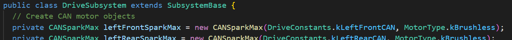

# Lesson 7: Making our own subsystem  11/14/2023

## Java Keyword Review
* `package` declares a 'name space' for the Java class. It must be put at the top of the Java file, as the first statement.  The unique names used allows Java to keep track of code in different libraries and files without overlapping.  (In FRC, the `package` is related to the directory structure.)
> Example: If you call an object `gyro` in your code, you don't want there to be any confusion with another object called `gyro` in the NavX library you imported. 
* `import` declares a Java class to use in the code below the import statement. Once a Java class is declared, then the class name can be used in the code without specifying the package the class belongs to.
* `public` declares a class member's access as open to the rest of the code. Public members are visible to all other classes. This means that any other class can access a public variable or method. Further, **other classes can modify public variables** unless it is declared as `final`.
* `private` prevents access to a class member. That is, the member is only visible within the class, not from any other class (including subclasses).
> A best practice is to give variables private access by default and reserve public access to only those variable and methods that are required. This helps with encapsulation and information hiding, since it allows you to change the implementation of a class without affecting anyone using it.
* `final` is meant to protect a class member from duplication and accidental overwrite.
  - For a variable, `final` only allows a single assignment for the variable. That is to say, once the variable has been assigned, its value is in read-only. If the variable is a primitive type, its value will no longer change. If it is an object, only its reference will no longer change.
  - For a class, `final` forbids the creation of a subclass.
  - For a method, `final` forbids overwriting the method in a subclass.
> For instance, using `@Override` to change an extended class method's function would be forbidden.
* `void` is used to specify that the method does not return any value.
* `new` creates a Java object and allocates memory for it on the heap.  What's the heap?  It is the blob of memory available to your program.
* `static` - A static variable, method or class has a single instance for the whole class that defines it. There can be only one! 

* `extends` indicates that the class is derived from the base class using inheritance. So basically, the `extends` keyword is used to extend the functionality of the parent class to the subclass. WPILib has done a lot of work for you.  When you see something like this:


That means that you are building up a parent class `SubsystemBase`.  If you want to see what is in that parent class, hover your cursor over the name `SubsystemBase` after "extends" and right click.  Select "Go to Definition":


[Extend vs Implement](https://www.geeksforgeeks.org/extends-vs-implements-in-java/)

* `super` is used inside a sub-class method definition to call a method defined in the super class (i.e. the 'parent' class).
> Example: When we create the 'helper' classes like `PIDCommand` or `PIDSubsystem`, you will see a call to `super` at the beginning.  This just means that you are calling code that has already been written for you.  I have started to avoid these 'convenience' classes because it is difficult to visualize what they are doing.
* `this` is an object refering to itself. Used to pass the current object as a parameter to another method. [Examples of `this`](https://en.wikibooks.org/wiki/Java_Programming/Keywords/this)
* `null` is a special Java literal which represents a null value: a value which does not refer to any object. It is an error to attempt to dereference the `null` value - Java will throw a NullPointerException. `null` is often used to represent uninitialized state.
* `true`/`false` - There are two boolean literals:
  - `true` represents a true boolean value (often interpreted as the number 1)
  - `false` represents a false boolean value (often interpreted as the number 0)
* `lambda` functions, which we will see as: `() ->` are a shortcut to define a function without having to create yet another class for it.  You will see this often in our robot code, and it is simply a way to avoid having to write out a bunch of extra code to make it work.
> Also called the "arrow" operator, a lambda expression is a short block of code which takes in parameters and returns a value. Lambda expressions are similar to methods, but they do not need a name and they can be implemented right in the body of a method.
>
> The simplest lambda expression contains a single parameter and an expression:
> parameter -> expression
>
> To use more than one parameter, wrap them in parentheses:
> (parameter1, parameter2) -> expression
>
> Lambda expressions are limited. They have to immediately return a value, and they cannot contain variables, assignments or statements such as `if` or `for`.
>
> So, instead of writing this:
> ```java
> Runnable r1 = new Runnable() {
>   @Override
>   public void run() {
>       System.out.print(" method Run ");
>   }
> };
> ```
>
> We write this:
> ```java
> Runnable r1 = ()-> System.out.print(" method Run ");
> ```
> Isn't that easier to read? (it's not very clear here - check the next example)

Need to see that another way?  When we see this in `RobotContainer.java`:


We are trying to avoid creating this `TeleopDrive.java` command:
```java
package frc.robot.commands;

import edu.wpi.first.wpilibj.Joystick;
import edu.wpi.first.wpilibj2.command.CommandBase;
import frc.robot.subsystems.DriveSubsystem;

public class TeleopDrive extends CommandBase {
  private final DriveSubsystem m_drive;
  private final Joystick m_joy;

  public TeleopDrive(Joystick joy, DriveSubsystem drive) {
    m_joy = joy;
    m_drive = drive;
    addRequirements(m_drive);
  }

  @Override
  public void execute() {
    m_drive.arcadeDrive(-m_joy.getY(), -m_joy.getX());
  }

  @Override
  public boolean isFinished() {
    return false;
  }
}
```

See the shortcut?

## Programming Exercise: Intake subsystem follow-along
Wow, that was a lot to take in. Let's go back to programming! We're going to step through an example of adding a subsystem for Thomas.  This is the challenge assignment from the last lesson - creating a way to turn the intake motor.

### Intake Subsystem Steps
1. Go to VSCode, open the project `ThomasCanGo` from last week and make sure you have the `Velocity_Profile` branch open!
2. In the file explorer, hover the cursor over the `subsystems` folder and right click:


3. At the bottom of the list, select "Create a new class/command".  Pick "Subsystem" and name it `Intake`.
4. Where would we look to find an example of this type of subsystem?  WPILib docs!
   * Start at [https://docs.wpilib.org/en/stable/index.html](https://docs.wpilib.org/en/stable/index.html)
   * Scroll down to "WPILib Example Projects"
   * Look for the heading [Command-Based Examples](https://docs.wpilib.org/en/stable/docs/software/examples-tutorials/wpilib-examples.html#command-based-examples)
   * A good place to start is the "Gears Bot" - Java, of course.
   * Find the subsystem called [Claw.java](https://github.com/wpilibsuite/allwpilib/blob/main/wpilibjExamples/src/main/java/edu/wpi/first/wpilibj/examples/gearsbot/subsystems/Claw.java)
5. What do we want this object to act on?  The motor driver! What kind to we have?  Use the drive motors in `DriveSubsystem.java` as an example:



6. What does the motor need to do?  We must create methods for `ConeGrab`, `ConeDrop`, and `Stop`.  Follow the example in `Claw.java`.
7. That should be all we need for the subsystem.  Now how do we trigger it?  We will work on commands next time, so we will use the **Lambda** shortcut to bind buttons in `RobotContainer`:
```java
// Spin the intake when the button is held
new JoystickButton(m_driverController, OIConstants.kButtonA)
    .onTrue(new InstantCommand(() -> m_intake.ConeGrab()))
    .onFalse(new InstantCommand(() -> m_intake.Stop()));
```
> Note: You did create the `m_intake` object in `RobotContainer` for your subsystem code, right?
8. If you fixed all your errors, download it to the robot and test!

## Extra Points:
* Move all "magic" numbers to `Constants.java`
* Push the motor RPM to Shuffleboard.
* Document your code with comments!
* Create a proper command file to run the intake.

### Other examples and resources
* [SparkMax Code Examples](https://docs.revrobotics.com/sparkmax/software-resources/spark-max-code-examples)
* [Longer discussion of Lambda Expressions](https://docs.wpilib.org/en/stable/docs/software/basic-programming/functions-as-data.html#lambda-expressions-in-java)
* [Reference for Java Keywords](https://en.wikibooks.org/wiki/Java_Programming/Keywords)
