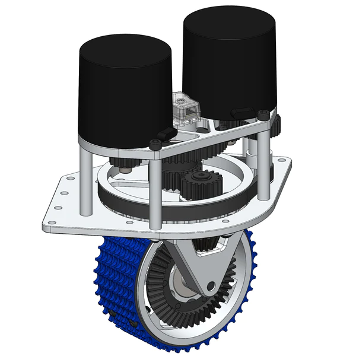
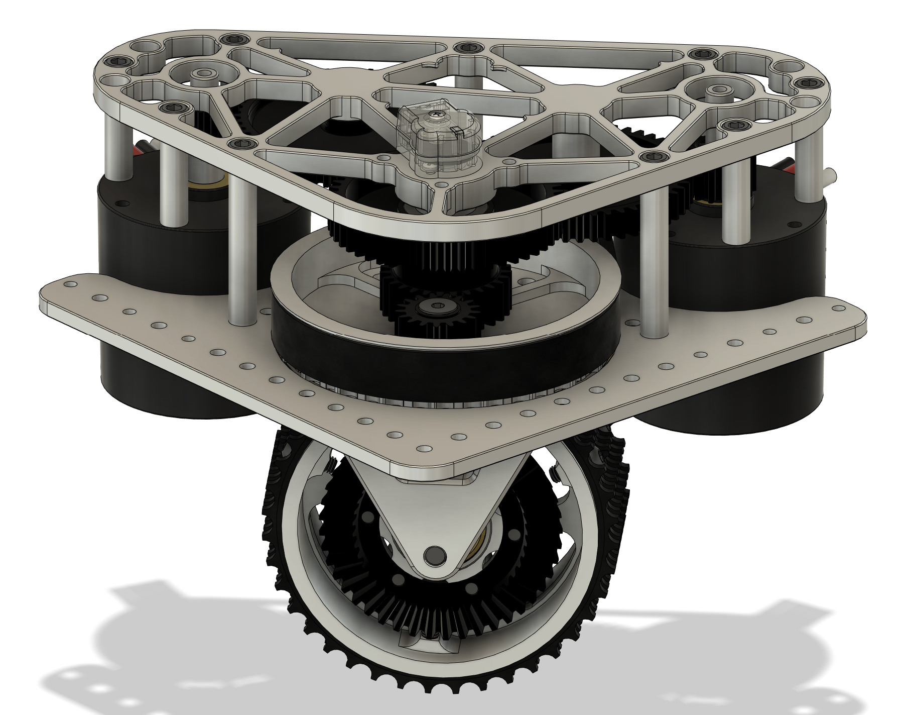
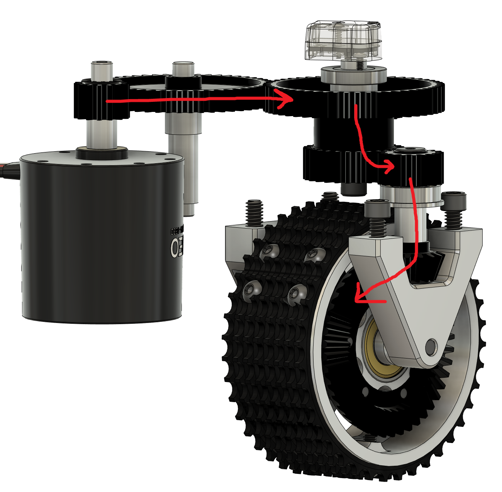
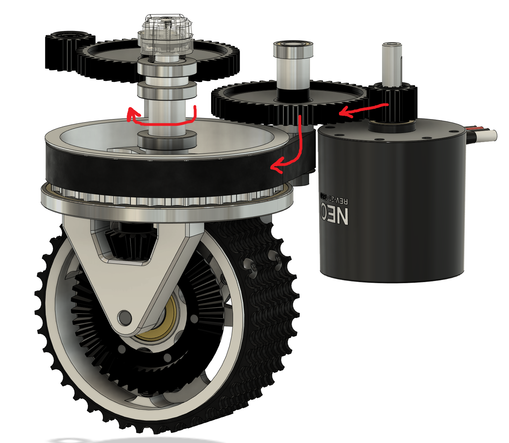
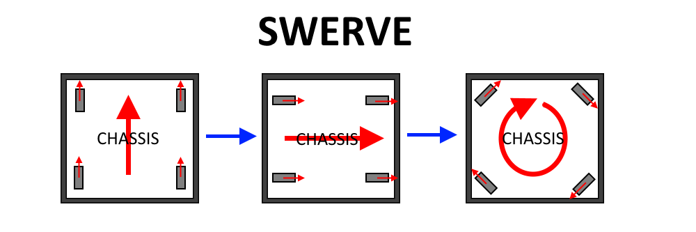
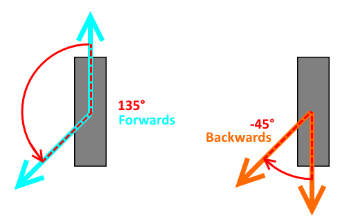
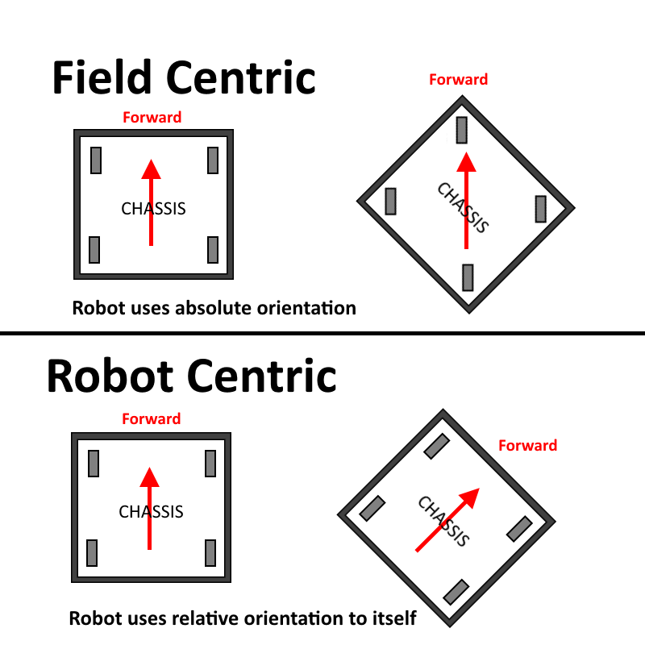

# Lesson 10: Introduction to Swerve  11/30/2023
We're here!  This is what we have all been waiting for, right?  Time to learn how to program that funky drive system that moves any direction!

[What can swerve do?](https://www.youtube.com/watch?v=wCakzMfRPKs)

## Hardware description


This is not our swerve drive - but it's easier to understand.  Our drive has motors that are inverted, so the module is not so tall and the center of gravity is lower.

Important points
* One motor steers the wheel by turning the belt near the main plate.
* One motor drives the wheel using the bevel gear on the side of the wheel.
* The small box in between the motors measures the ABSOLUTE wheel direction.

## Our module


## Drive Power


## Turn Power


## Movement concepts
We must think in terms of chassis movement - the entire robot as a whole.  In order to get the wheels to move in unison so the chassis does what we expect, we need to set EXACT motor velocites in meters per second.


> Question: Which part of the robot is the front?

### Building the Kinematics object
Before we can move, we have to build a math model that can direct each wheel.  Luckily, this is done for us - but we have to explain where each swerve wheel is physically located.  **ALL MEASUREMENTS ARE IN METERS!**
```java
// Locations for the swerve drive modules relative to the robot center.
Translation2d m_frontLeftLocation = new Translation2d(0.381, 0.381);
Translation2d m_frontRightLocation = new Translation2d(0.381, -0.381);
Translation2d m_backLeftLocation = new Translation2d(-0.381, 0.381);
Translation2d m_backRightLocation = new Translation2d(-0.381, -0.381);

// Creating my kinematics object using the module locations
SwerveDriveKinematics m_kinematics = new SwerveDriveKinematics(
  m_frontLeftLocation, m_frontRightLocation, m_backLeftLocation, m_backRightLocation
);
```

### Converting chassis speeds to module states
Now that we have a swerve drive movement model, we must be able to tell it which way to move.  We do this by telling the kinematic model the velocities it should move (in **meters** per second) and let the model calculate the speed and direction for each wheeel. The class `SwerveModuleState` contains the steering angle and drive velocity of each swerve module.

```java
// Example chassis speeds: 1 meter per second forward, 3 meters
// per second to the left, and rotation at 1.5 radians per second
// counterclockwise.
ChassisSpeeds speeds = new ChassisSpeeds(1.0, 3.0, 1.5);

// Convert to module states
SwerveModuleState[] moduleStates = kinematics.toSwerveModuleStates(speeds);

// Wheel module states
SwerveModuleState frontLeft = moduleStates[0];
SwerveModuleState frontRight = moduleStates[1];
SwerveModuleState backLeft = moduleStates[2];
SwerveModuleState backRight = moduleStates[3];
```

> **Important note!** The order that the wheel coordinates are added to the kinematics object define the order that the `SwerveModuleState` data is in!

### Optimize wheel movements
On a swerve drive, the wheels are constantly in motion, especially when transitioning from pure translational chassis motion to pure rotational chassis motion. In order to save time and wheel tread, it is possible to reduce wheel steering greater than 90 degrees by allowing wheel drive reversals.



```java
var frontLeftOptimized = SwerveModuleState.optimize(frontLeft,
   new Rotation2d(m_turningEncoder.getDistance()));
```

### Details... Calibrate offsets
Each absolute encoder has it's own offset.  The magnet used for each wheel is installed randomly, so we have to figure out where each wheel is pointed.  **When calibrating the offsets, you MUST turn off wheel optimization!**

### Field-oriented drive
Many video games these days are "field centric" - meaning that you see the map area around your character and your joystick moves the character in the direction of the field, not the direction the character is facing.  This makes it much easier to drive - especially if your robot can spin while it's driving! 



When the robot boots up, it will select a default "forward" direction unless we tell it how the robot is oriented with respect to the playing field.

## Programming exercise
1. In VSCode, close any folder you have open.  Go to the Source Control tab and clone the repository:
```
https://github.com/FRC-Team8744/Swivels_SwerveBot
```
2. Create your own branch, so you can change the code without modifying the repository.
3. Study the code. Ask questions. Try it out.

## Programming challenges
* How do you put the swerve drive info on Shuffleboard?
* How do you calibrate the absolute encoder offsets?
* Is the wheel odometry accurate?

#### Resources
* [Swerve Central](http://team1640.com/wiki/index.php/Swerve_Central) - excellent resource covering technical details about how swerve evolved in FRC
* [Project Robotica: Swerve](https://projectrobotica.wiki/wiki/FTC:Swerve_Drivetrains) - FTC, but some good visuals
* [Swerve Drive Math!](https://www.freshconsulting.com/insights/blog/how-to-build-a-swerve-drive-robot/)
* [Team 6624 swerve software guide](https://compendium.readthedocs.io/en/latest/tasks/drivetrains/swerve.html)
