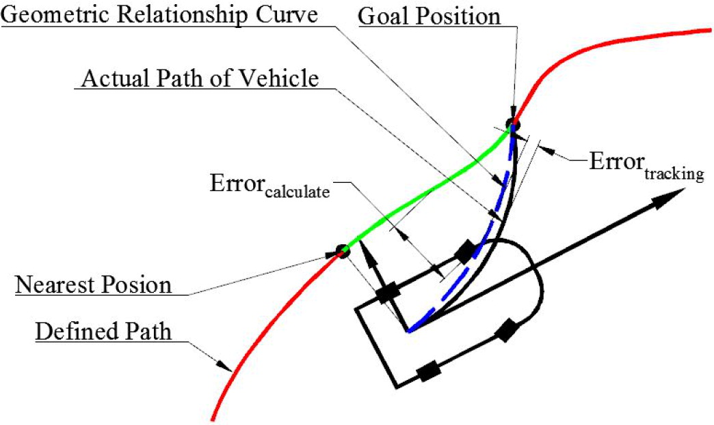

# Lesson 11: Creating and using trajectories

Let's take a quick assesment of the topics we have covered:
* Java quick start
* Downloading code to the robot
* Turning the robot to an angle
* Command-based programming
* Controlling motors
* Reading sensors
* PID control concepts and tuning
* Profiled motion
* Code debug
* Library install and use
* Binding joystick triggers to software events
* Kinematics and odometry
* Creating subsystems
* Using GitHub for code sharing
* Programming a swerve drive robot

Whew! That's a lot!  Is everyone ready for the season to start?

* convert Swivels_SwerveControllerCommand to joystick
* Autonomous command selector
* simple drive & turn, command groups
* PathPlanner description & install
* create & test

Next week, we will be simulating Kickoff and will need to think about how to break up the programming of a new robot.  That will use up the rest of our meetings before January.  What should we cover on Thursday, so everyone is more confident about starting the season?

Thursday:
* Reflashing radio firmware
* Direct cable connection to the robot
* REV motor driver direct connection
* Interfacing with cameras


## Driving the robot in Autonomous
Previously, we worked on some simple motion commands - turn to angle, drive a set distance, and limiting speeds with profiled motion.  This works great for simple navigation: start here, back up 0.5 meters, rotate 45 degrees, drive forward 0.2 meters, etc.  But what happens when we want to move from one location on the field to another **without slowing down at each segment**?  What if we want to chase down a ball that rolled on the field and then automatically return to the scoring station?

To make these types of problems easier to solve, we will learn about defining a trajectory that the robot can follow by itself.  A trajectory is like making a map of where you want the robot to go.

How does the robot follow a trajectory?  We create a controller object which tracks the robot's error from the defined path.  The controller will do it's best to move the robot back to the path as it travels.



## Start of programming exercise
1. Go to VSCode and clone the project `Swivels_SwerveControllerCommand`.
2. Make your own branch from `main`.

Let's take a look at the path following controller code.  It is located at the bottom of `RobotContainer`, because they defined the command in-line for the example.

For starters, a `TrajectoryConfig` object is set up to keep track of the maximum allowed speeds, rotations, and accelerations:

```java
  public Command getAutonomousCommand() {
    // Create config for trajectory
    TrajectoryConfig config =
        new TrajectoryConfig(
                AutoConstants.kMaxSpeedMetersPerSecond,
                AutoConstants.kMaxAccelerationMetersPerSecondSquared)
            // Add kinematics to ensure max speed is actually obeyed
            .setKinematics(DriveConstants.kDriveKinematics);
```

Next, the actual trajectory is defined.  It is made up of a list of segments which define the start, end, and waypoints in the path:

```java
    // An example trajectory to follow.  All units in meters.
    Trajectory exampleTrajectory =
        TrajectoryGenerator.generateTrajectory(
            // Start at the origin facing the +X direction
            new Pose2d(0, 0, new Rotation2d(0)),
            // Pass through these two interior waypoints, making an 's' curve path
            List.of(new Translation2d(1, 1), new Translation2d(2, -1)),
            // End 3 meters straight ahead of where we started, facing forward
            new Pose2d(3, 0, new Rotation2d(0)),
            config);
```

Then, we have to define the PID controllers that try to follow the path.  We will have to tune these parameters on a new robot.

```java
    var thetaController =
        new ProfiledPIDController(
            AutoConstants.kPThetaController, 0, 0, AutoConstants.kThetaControllerConstraints);
    thetaController.enableContinuousInput(-Math.PI, Math.PI);

    SwerveControllerCommand swerveControllerCommand =
        new SwerveControllerCommand(
            exampleTrajectory,
            m_robotDrive::getPose, // Functional interface to feed supplier
            DriveConstants.kDriveKinematics,

            // Position controllers
            new PIDController(AutoConstants.kPXController, 0, 0),
            new PIDController(AutoConstants.kPYController, 0, 0),
            thetaController,
            m_robotDrive::setModuleStates,
            m_robotDrive);
```

## Create your own command to follow a path
3. In the file explorer, hover the cursor over the `commands` folder and right click.  At the bottom of the list, select "Create a new class/command".  Pick "Command" and name it `Auto_Path`.
4. 
* In `RobotContainer`, replace the example with your command name:
```java
public Command getAutonomousCommand() {return new YourCommand()}
```

## Create a command selector
Once we have several possiblities for paths, we need to be able to select between them.  We do this with a [Sendable Chooser](https://docs.wpilib.org/en/stable/docs/software/dashboards/smartdashboard/choosing-an-autonomous-program-from-smartdashboard.html#creating-the-sendablechooser-object). We follow this general sequence:

```java
public class RobotContainer {
    // A chooser for autonomous commands
    SendableChooser<Command> m_chooser = new SendableChooser<>();
```

```java
    public RobotContainer() {
        // Add commands to the autonomous command chooser
        m_chooser.setDefaultOption("Simple Auto", m_simpleAuto);
        m_chooser.addOption("Complex Auto", m_complexAuto);

        // Put the chooser on the dashboard
        SmartDashboard.putData(m_chooser);
```

``` java
public Command getAutonomousCommand() {
    return m_chooser.getSelected();
  }

```
